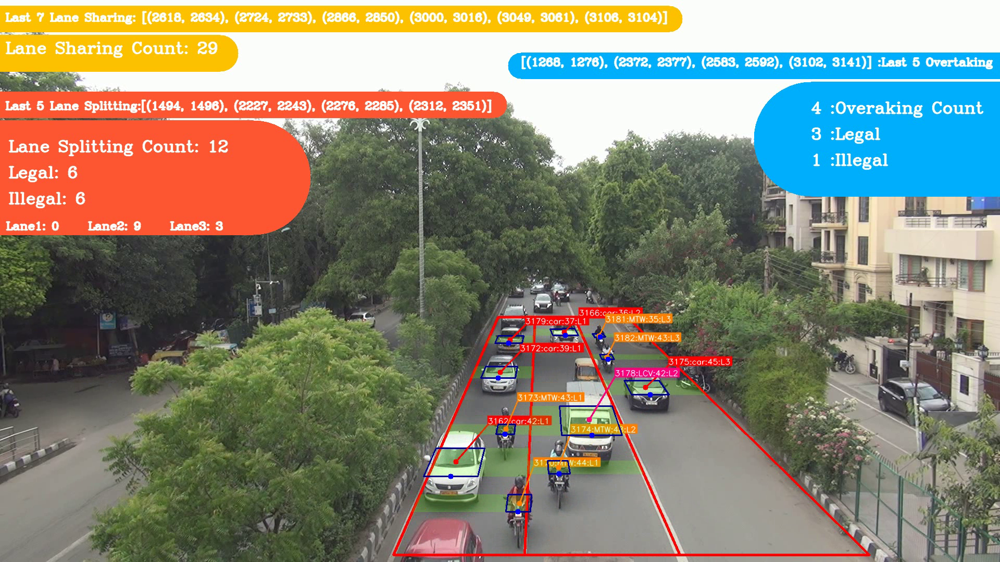
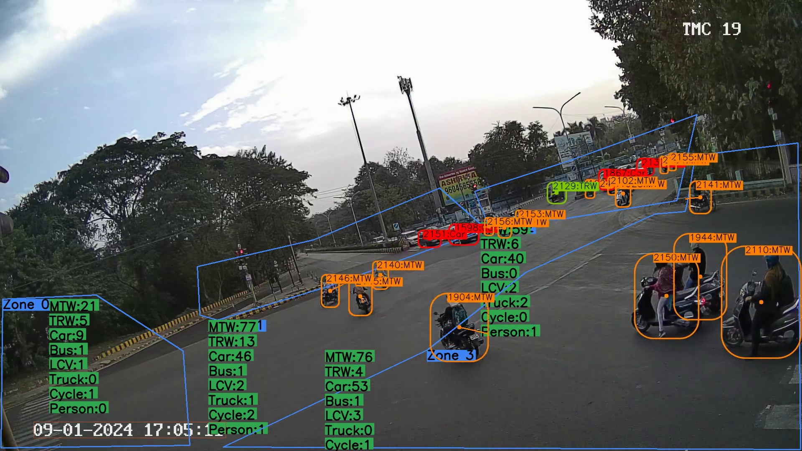
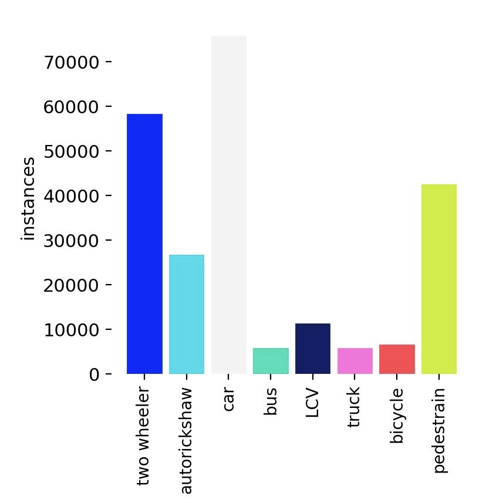
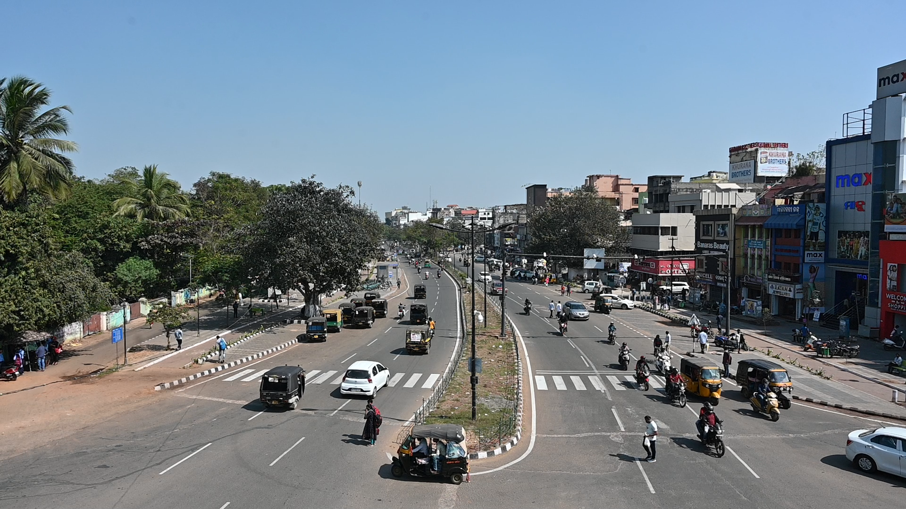
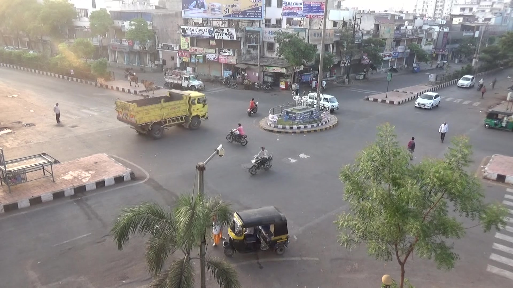
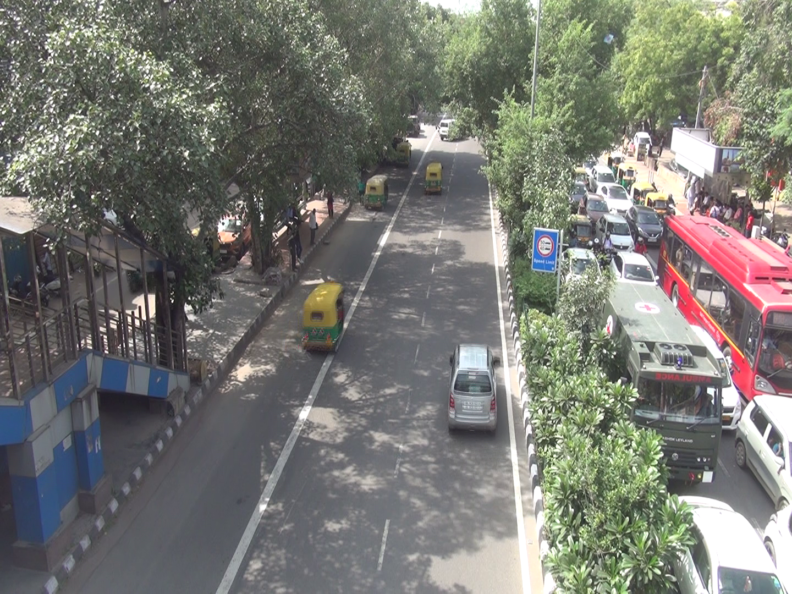
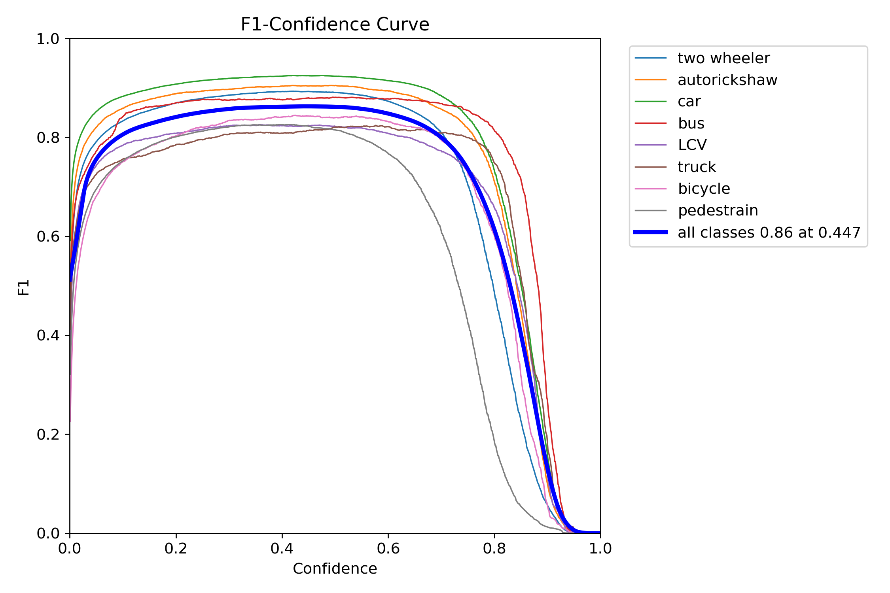
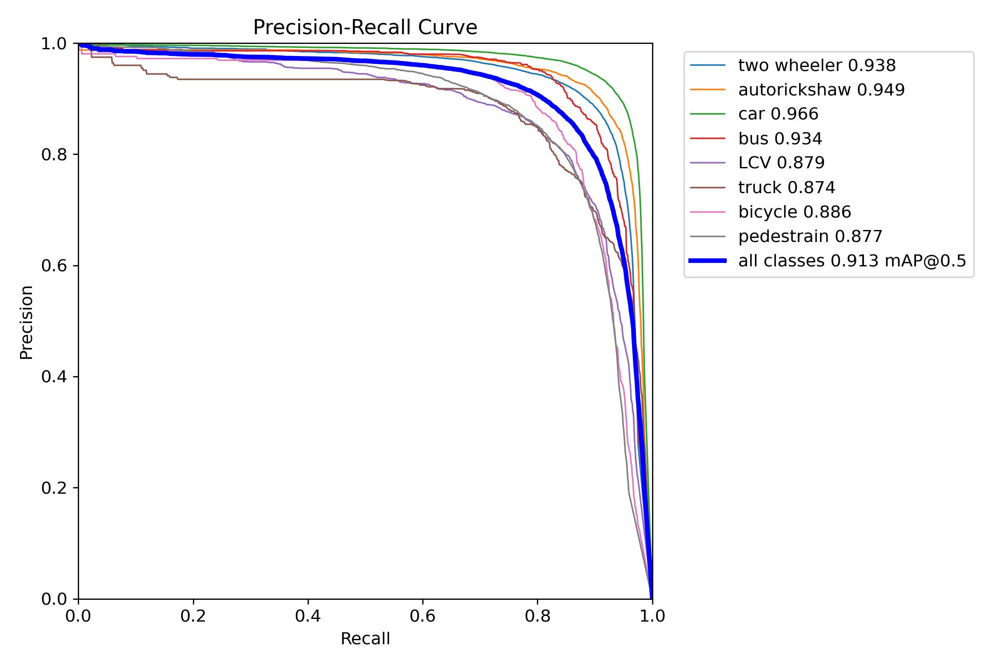
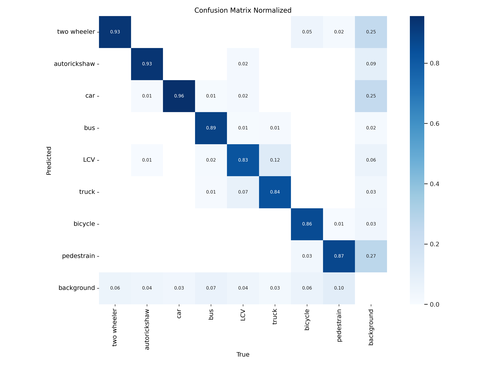

# ITD – Indian Traffic Dataset

The **ITD (Indian Traffic Dataset)** is a large-scale dataset designed to advance research in **traffic video analytics** for Indian road environments. [Original Paper Link](https://ieeexplore.ieee.org/document/10427394)
It captures the complex and heterogeneous traffic conditions found across India, enabling tasks such as **turning movement counts**, **lane-based behavior analysis**, and **violation detection**.
[Download Models](https://quirrelhk.github.io/model-download-page/)

## Applications and Use Cases

The ITD dataset enables a broad range of **traffic video analytics** tasks critical for intelligent transportation systems (ITS) and urban mobility research.  
Below are some key applications demonstrated using trained models on ITD.

---

<table>
  <tr>
    <td align="center">
       
      <b>(a)</b> Lane Behaviour Analysis – Detects lane discipline, filtering, and merging behavior in heterogeneous traffic.
    </td>
    <td align="center">
       
      <b>(b)</b> Turning Movement Counts (TMC) – Tracks and classifies vehicle trajectories at intersections for traffic flow studies.
    </td>
  </tr>
  <tr>
    <td colspan="2" align="center">
       
      <b>(c)</b> Time-to-Collision (TTC) Estimation – Evaluates road safety and driver behavior using proximity-based temporal analysis.
    </td>
  </tr>
</table>

  <em>Fig 1: Representative applications of the ITD dataset, demonstrating its use for lane-level analysis, intersection traffic modeling, and safety assessment.</em>

---

## Dataset Overview

We have made upgrades to the ITD dataset, resulting in a new version (v1.2) with enhanced features:

| Property | Description |
|-----------|--------------|
| **Name** | ITD – Indian Traffic Dataset v1.2 |
| **Scope** | Multi-class, multi-location dataset for traffic flow analysis and computer vision model training |
| **Scale** | 280,000+ labeled objects, 9,200+ annotated images |
| **Coverage** | 25+ diverse locations across **14 states/UTs** in India |
| **Data Type** | Annotated traffic images and video frames |
| **Applications** | Object detection, vehicle classification, traffic flow modeling, violation and safety analysis |
| **Annotation Standard** | Indo-HCM (Indian Highway Capacity Manual) based classification |
| **Image Conditions** | Day, night, urban, highway, and expressway scenes under varied weather and density conditions |

---

## Regional Diversity

The dataset spans:
- Expressways  
- National and State Highways  
- Major District Roads  
- Arterial and Urban routes  

This diversity ensures high model robustness to Indian traffic heterogeneity.

  <em>Fig 2: Spatial diversity of ITD v1.2 dataset locations across India, covering multiple states and road types.</em>

### Object Categories

The dataset follows Indo-HCM vehicle classification and covers key road-user categories such as:
- Two-Wheelers  
- Auto Rickshaws  
- Cars / Jeeps / Vans  
- Light Commercial Vehicles  
- Buses  
- Trucks / HCVs  
- Bicycles
- Pedestrians  

<table>
  <tr>
    <td align="center">
       
      <b>(a)</b> ITD - Labels Composition – Distribution of annotated object categories in the dataset.
    </td>
    <td align="center">
       
      <b>(b)</b> Example FOV 1.
    </td>
  </tr>
  <tr>
    <td align="center">
       
      <b>(c)</b> Example FOV 2.
    </td>
    <td align="center">
       
      <b>(d)</b> Example FOV 3.
    </td>
  </tr>
</table>

  <em>Fig 3: Class distribution and examples FOVs in ITD showing diverse traffic conditions.</em>

---

## Model Evaluation and Results

The models trained on the **ITD v1.2 dataset** were evaluated to benchmark their performance on real-world Indian traffic scenarios.  
Evaluation was conducted using the **YOLOv8 architecture**.

### Object Detection Performance
| Metric | Value |
|---------|--------|
| **mAP (50)** | 0.91 |
| **Precision** | 0.87 |
| **Recall** | 0.86 |

These results demonstrate the model’s ability to reliably detect and classify vehicles in heterogeneous and dense traffic scenes, maintaining a strong balance between precision and recall.

---

### Performance Visualization

<table>
  <tr>
    <td align="center">
       
      <b>(a)</b> F1 Curve – Shows the balance between precision and recall across confidence thresholds, indicating stable detection consistency.
    </td>
    <td align="center">
       
      <b>(b)</b> Precision–Recall Curve – Illustrates model confidence and class separation efficiency across varying detection thresholds.
    </td>
  </tr>
  <tr>
    <td colspan="2" align="center">
       
      <b>(c)</b> Normalized Confusion Matrix – Highlights per-class detection accuracy and common misclassification trends among visually similar vehicle categories.
    </td>
  </tr>
</table>

  <em>Fig 4: Quantitative results of the YOLOv8 model trained on ITD v1.2, showing high detection stability across diverse traffic conditions.</em>

---

## License

The pretrained models are released under the:

> [Creative Commons Attribution-NonCommercial 4.0 International License](./LICENSE)  
> You are free to share and adapt the data for **research and non-commercial purposes**,  
> provided appropriate credit is given to the original authors.

**Citation / Acknowledgment**  
> If you use this dataset or derivative models, please cite:  
> *Agarwal, Amit, Anurag Thombre, Kabir Kedia and Indrajit Ghosh (2024). “ITD: Indian Traffic Dataset for Intelligent Transportation Systems”. In 16th International Conference on COMmunication Systems & NETworkS (COMSNETS), Bengaluru, India DOI:10.1109/COMSNETS59351.2024.10427394*

---

## Access Request

The dataset is currently available for **research use upon request**.
[ITD Models Download Link](https://quirrelhk.github.io/model-download-page/)

